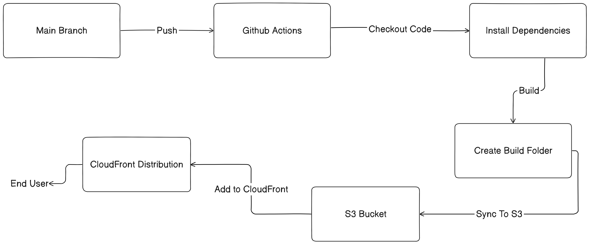

# NoteFlare

An all-in-one note-taking application that lets you use Markdown to create notes, tag them individually, and filter them based on tags. This includes sophisticated features like the ability to edit and delete tags and notes. Let's take note in [NoteFlare](https://noteflare.netlify.app/)

## Deployment Pipeline

